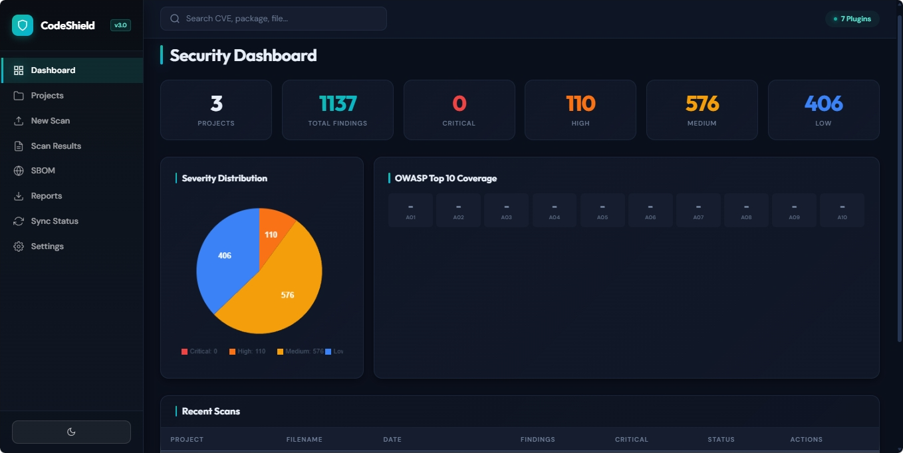
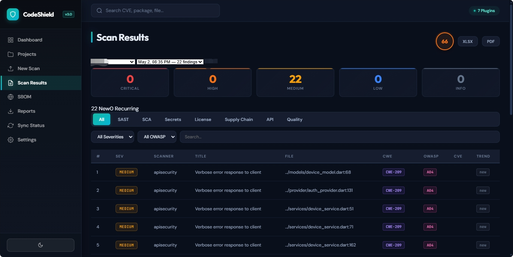
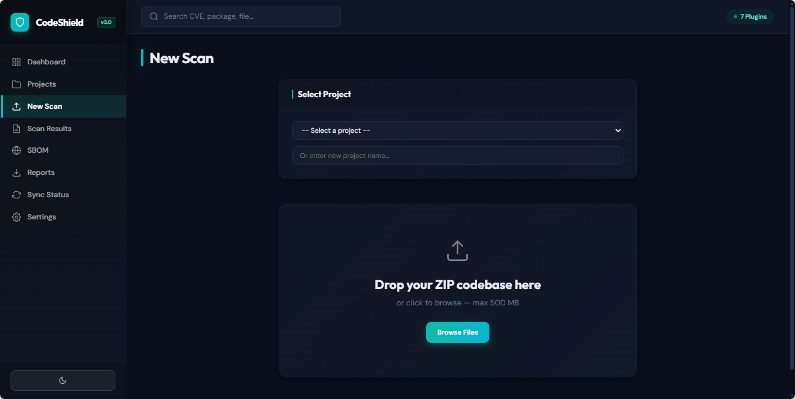
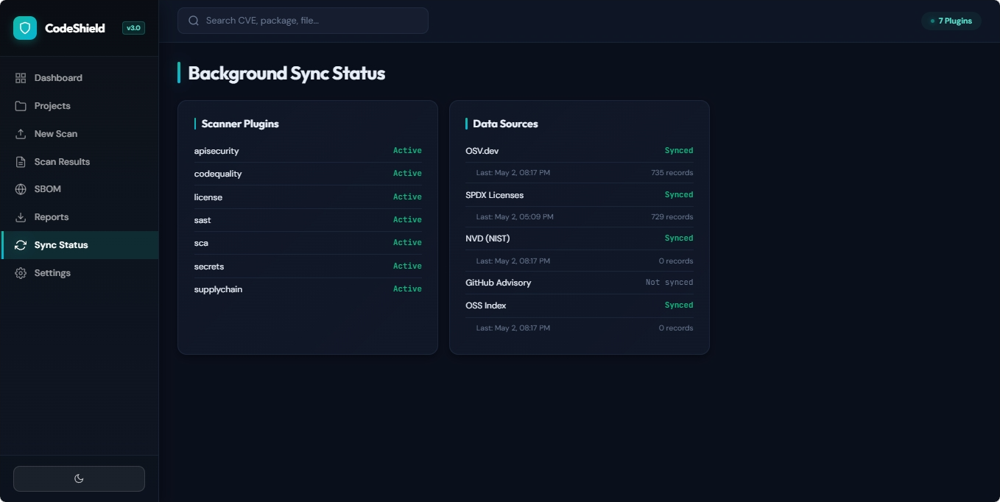

<p align="center">
  
  <br/>
  <strong>Enterprise-grade, multi-dimensional security scanner for codebases</strong>
</p>

<p align="center">
  
  
  
  
</p>

<p align="center">
  
</p>

---

## Overview

CodeShield is a **production-ready, locally-running** Python application that performs comprehensive security scanning on uploaded ZIP codebases. It follows a **Project → Scans → Findings** architecture where every scan is scoped to a project for full traceability.

### Key Capabilities

| Category | Details |
|---|---|
| **SAST** | 16 pattern rules covering injection, XSS, path traversal, crypto weaknesses |
| **SCA** | Dependency vulnerability matching via OSV.dev, NVD, GitHub Advisory |
| **Secrets Detection** | 14 patterns for API keys, tokens, passwords, private keys |
| **License Compliance** | 729 SPDX license definitions, copyleft/restrictive flagging |
| **Supply Chain** | Lockfile integrity, typosquatting detection, dependency confusion |
| **API Security** | Insecure endpoint patterns, missing auth, CORS misconfig |
| **Code Quality** | Complexity analysis, dead code, TODO/FIXME tracking |

### Security Enrichment (per finding)

Every finding includes: **CWE ID**, **OWASP Top 10** mapping, **MITRE ATT&CK** technique, **PCI-DSS** & **HIPAA** references, exploit availability, fix effort estimate, and trend analysis (new vs recurring).

---

## Screenshots

<table>
  <tr>
    <td width="50%"><br/><p align="center"><strong>Security Dashboard</strong> — aggregated project stats, severity pie chart, OWASP heatmap</p></td>
    <td width="50%"><br/><p align="center"><strong>Scan Results</strong> — filterable findings with CWE, OWASP, CVE tags</p></td>
  </tr>
  <tr>
    <td width="50%"><br/><p align="center"><strong>New Scan</strong> — project-scoped upload with real-time progress</p></td>
    <td width="50%"><br/><p align="center"><strong>Plugins & Sync</strong> — 7 scanner plugins, multi-source vulnerability sync</p></td>
  </tr>
</table>

---

## Quick Start

```bash
# Clone
git clone https://github.com/ne0psych/codeshield.git
cd codeshield

# Virtual environment
python -m venv venv
source venv/bin/activate        # Linux/macOS
# venv\Scripts\activate         # Windows

# Install dependencies
pip install -r requirements.txt

# (Optional) Configure API keys
cp .env.example .env
# Edit .env with your NVD/GitHub keys

# Start
python run.py
```

Open **http://127.0.0.1:5000** — create a project, upload a ZIP, and scan.

---

## Project Architecture

```
codeshield/
├── app.py                  # Flask application factory + startup
├── config.py               # Multi-source config (TOML + env vars)
├── engine.py               # Scan orchestrator (zero detection logic)
├── context.py              # File tree & scan context builder
├── mappings.py             # CWE / OWASP / MITRE / compliance mappings
├── database/
│   ├── connection.py       # SQLite WAL-mode connection manager
│   └── schema.py           # Auto-migrating schema (v1 → v3)
├── plugins/                # Auto-discovered scanner plugins
│   ├── base.py             # Plugin interface + Finding dataclass
│   ├── registry.py         # Plugin auto-discovery
│   ├── sast_plugin.py      # Static analysis (regex + AST)
│   ├── sca_plugin.py       # Software composition analysis
│   ├── secrets_plugin.py   # Secrets & credential detection
│   ├── license_plugin.py   # License compliance (SPDX)
│   ├── supplychain_plugin.py  # Supply chain security
│   ├── apisecurity_plugin.py  # API security patterns
│   └── codequality_plugin.py  # Code quality metrics
├── reports/
│   ├── pdf_report.py       # PDF generation (fpdf2)
│   └── excel_report.py     # Excel generation (openpyxl + charts)
├── structures/             # Custom data structures
│   ├── aho_corasick.py     # Multi-pattern string matching
│   ├── interval_tree.py    # Version range matching
│   ├── bloom_filter.py     # Probabilistic dedup
│   ├── dependency_graph.py # DAG for dependency analysis
│   ├── inverted_index.py   # Full-text search index
│   └── lru_cache.py        # Thread-safe LRU cache
├── sync/                   # Vulnerability data sync engine
│   ├── engine.py           # Orchestrator (blocking + async threads)
│   ├── osv.py              # OSV.dev API
│   ├── nvd.py              # NVD REST API v2.0
│   ├── github_advisory.py  # GitHub Advisory GraphQL
│   ├── ossindex.py         # Sonatype OSS Index
│   ├── spdx.py             # SPDX license list
│   └── rules.py            # Remote SAST/secrets rule sync
├── web/
│   ├── routes.py           # Flask routes (project CRUD, upload, reports)
│   └── sse.py              # Server-Sent Events for scan progress
├── templates/
│   └── index.html          # SPA dashboard template
└── static/
    ├── app.js              # Project-centric UI logic
    └── style.css           # Dark/light theme design system
```

---

## API Reference

### Projects

| Method | Endpoint | Description |
|--------|----------|-------------|
| `GET` | `/api/projects` | List all projects with aggregated stats |
| `POST` | `/api/projects` | Create new project `{name, description}` |
| `GET` | `/api/projects/<id>` | Project detail + scan history |
| `PUT` | `/api/projects/<id>` | Update project name/description |
| `DELETE` | `/api/projects/<id>` | Delete project and all scans |

### Scanning

| Method | Endpoint | Description |
|--------|----------|-------------|
| `POST` | `/api/upload` | Upload ZIP (requires `project_id` or `project_name`) |
| `GET` | `/api/scan/<id>/events` | SSE stream for real-time scan progress |
| `GET` | `/api/scan/<id>/results` | Full scan results with project context |
| `GET` | `/api/scan/<id>/risk-score` | Computed risk score (0–100) |
| `GET` | `/api/scan/<id>/trends` | New vs recurring analysis |

### Reports

| Method | Endpoint | Description |
|--------|----------|-------------|
| `GET` | `/api/scan/<id>/report/pdf` | Download PDF report |
| `GET` | `/api/scan/<id>/report/excel` | Download Excel report |

### System

| Method | Endpoint | Description |
|--------|----------|-------------|
| `GET` | `/api/health` | Health check + plugin list |
| `GET` | `/api/scans` | Recent scan history |
| `GET` | `/api/sync/<source>` | Data source sync status |

---

## Configuration

All settings are in `config.toml` with environment variable overrides:

```bash
# Optional: NVD API key (increases rate limit 10x)
export CODESHIELD_NVD_API_KEY=your-key

# Optional: GitHub token for advisory sync
export GITHUB_TOKEN=ghp_your-token

# Optional: Custom database path
export CODESHIELD_DB_PATH=./data/codeshield.db
```

See `.env.example` for all available variables.

---

## Data Model

```
Project (1) ──→ (N) Scan ──→ (N) Finding
                      │
                      └──→ SBOM (CycloneDX)
```

- **Projects** group related scans (e.g., "My Web App")
- **Scans** are individual ZIP uploads with timestamped results
- **Findings** are severity-classified vulnerabilities tied to a specific scan
- Existing scans are auto-migrated to projects on first v3 startup

---

## Vulnerability Data Sources

| Source | Type | Sync Mode |
|--------|------|-----------|
| [OSV.dev](https://osv.dev) | Vulnerabilities | Blocking (startup) |
| [SPDX](https://spdx.org) | License definitions | Blocking (startup) |
| [NVD](https://nvd.nist.gov) | CVE database | Background thread |
| [GitHub Advisory](https://github.com/advisories) | Security advisories | Background thread |
| [OSS Index](https://ossindex.sonatype.org) | Component analysis | Background thread |

---

## Security Practices

- **ZIP bomb defense** — file count, uncompressed size, and nesting depth limits
- **Path traversal prevention** — symlink resolution + `..` rejection before extraction
- **Parameterized SQL** — no string interpolation in any query
- **XSS prevention** — Jinja2 autoescape + DOM `textContent` in JS
- **Input validation** — `secure_filename()`, UUID validation, size limits
- **Secret redaction** — detected secrets are masked in findings
- **No `shell=True`** — all subprocess calls use argument lists

---

## License

MIT — see [LICENSE](LICENSE) for details.
